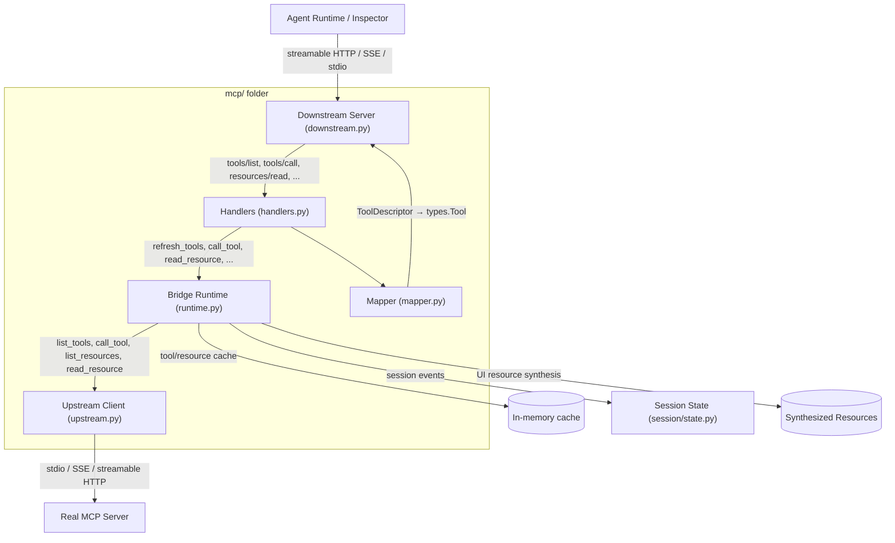
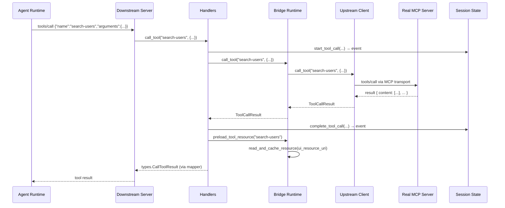

# MCP Layer Architecture

The `mcp/` folder is the protocol-aware boundary between upstream MCP servers and the agent runtime (or inspector). Every request from the agent flows through a pipeline of narrow, single-responsibility modules before reaching the real upstream server, and every response follows the same pipeline in reverse.

## Data Flow



## Module Responsibilities

### 1. `upstream.py` — Upstream MCP Clients

**What it does:** Connects to real MCP servers. Owns the transport layer for each supported protocol.

**Key types:**

| Type | Role |
|------|------|
| `UpstreamServerConfig` | Transport-agnostic config model (`stdio` / `sse` / `streamable-http`) |
| `UpstreamMcpClient` | Protocol defining the upstream interface (`connect`, `list_tools`, `call_tool`, `list_resources`, `read_resource`, `close`) |
| `StdioUpstreamMcpClient` | stdio transport implementation using `mcp.client.stdio` |
| `SseUpstreamMcpClient` | SSE transport implementation using `mcp.client.sse` |
| `StreamableHttpUpstreamMcpClient` | Streamable HTTP transport using `mcp.client.streamable_http`, with WSL localhost fallback |
| `build_upstream_client()` | Factory selecting the right client for a given config |

**Boundary rules:**
- Does not know about downstream transport, session state, or UI resource synthesis.
- Returns typed internal models (`ToolDescriptor`, `ToolCallResult`, `AppResource`, `UpstreamInitialization`).

---

### 2. `runtime.py` — Bridge Runtime

**What it does:** The middle layer. Owns the upstream lifecycle, maintains tool/resource caches, synchronizes session events, and handles bridge-specific logic like UI resource preloading and resource synthesis.

**Key class: `BridgeRuntime`**

| Method | Role |
|--------|------|
| `start()` / `close()` | Upstream lifecycle with identity tracking |
| `refresh_tools()` | Pull tools from upstream, update cache, notify session state |
| `refresh_resources()` | Pull resources from upstream, fall back to synthesized UI resources |
| `call_tool()` | Delegate tool invocation to upstream client |
| `preload_tool_resource()` | After a tool call, fetch the tool's UI resource (if any) into cache |
| `read_and_cache_resource()` | Read-once-then-cache resource access, notifies session state |
| `identity` | Exposes the upstream server's real `serverInfo` so the downstream can present it |

**Boundary rules:**
- Knows about upstream clients and session state.
- Does not know about MCP SDK `Server`, transport protocols, or HTTP routing.
- Does not know about FastAPI, starlette scopes, or agent-facing MCP handlers.

---

### 3. `downstream.py` — Downstream MCP Server

**What it does:** Hosts the MCP protocol surface that the agent (or inspector) connects to. Manages the SDK `Server`, streamable HTTP sessions, SSE fallback, and stdio transport.

**Key class: `BridgeDownstreamServer`**

| Method | Role |
|--------|------|
| `start()` / `close()` | Delegates to `BridgeRuntime` |
| `handle_streamable_http(scope, receive, send)` | Single-endpoint streamable HTTP dispatch |
| `handle_sse(scope, receive, send)` | Legacy SSE connect flow |
| `handle_sse_post(scope, receive, send)` | Legacy SSE message posting |
| `serve_stdio()` | stdio transport loop for agent-side MCP connections |
| `run_http_transports()` | Async context manager for the streamable HTTP session manager |

**Identity presentation:** Uses `runtime.identity` to populate `serverInfo` in `initialize` responses, so downstream clients see the upstream server's name and version rather than a bridge-internal name.

**Boundary rules:**
- Knows about `BridgeRuntime` and MCP SDK transport primitives.
- Does not know about cache internals, upstream transport details, or session events.

---

### 4. `handlers.py` — MCP Method Handlers

**What it does:** Registers `list_tools`, `call_tool`, `list_resources`, and `read_resource` on a given `Server` instance. All dependencies are injected as callables, so handlers remain testable and reusable across different upstream or downstream configurations.

**Key function: `register_proxy_handlers(server, session_state, ...)`**

Takes nine injectable callables:
- `refresh_tools`, `refresh_resources` — from `BridgeRuntime`
- `call_upstream_tool` — from `BridgeRuntime.call_tool`
- `read_and_cache_resource`, `preload_tool_resource` — from `BridgeRuntime`
- `to_mcp_tool`, `to_mcp_call_tool_result`, `to_mcp_resource`, `to_read_resource_contents` — from `mapper`

**Boundary rules:**
- Knows about `Server`, `BridgeSessionState`, and mapper function signatures.
- Does not own any state or cache.

---

### 5. `mapper.py` — Protocol Type Mapping

**What it does:** Pure, stateless conversion between internal Pydantic models and MCP SDK types. No side effects, no I/O.

**Key functions:**

| Function | Converts |
|----------|----------|
| `to_mcp_tool(tool)` | `ToolDescriptor` → `mcp.types.Tool` |
| `to_mcp_call_tool_result(result)` | `ToolCallResult` → `mcp.types.CallToolResult` |
| `to_mcp_resource(resource)` | `ResourceDescriptor` → `mcp.types.Resource` |
| `to_read_resource_contents(resource)` | `AppResource` → `ReadResourceContents` |
| `to_content_block(item)` | `dict` → `mcp.types.ContentBlock` (text / image / audio / embedded resource) |

**Boundary rules:**
- Pure functions only. No async, no state, no side effects.

---

### 6. `proxy.py` — Assembly Layer

**What it does:** Thin factory that wires a `BridgeRuntime` and `BridgeDownstreamServer` together from an `UpstreamServerConfig`. This is the only place where the runtime and downstream boundaries meet during construction.

**Key function: `build_proxy_server(upstream_config, session_state, ...)`**

Returns a `BridgeDownstreamServer` ready to be mounted in the FastAPI app or stdio loop.

**Boundary rules:**
- The only module allowed to import both `BridgeRuntime` and `BridgeDownstreamServer` simultaneously.

---

## Request Lifecycle Example: `tools/call`



## Future: Multi-Upstream

The current design supports one upstream ↔ one downstream. For multi-upstream, the natural extension is one `BridgeRuntime` + `BridgeDownstreamServer` per upstream, with a **router** (not shown) that maps agent-facing MCP endpoints to the correct downstream server:

```text
/mcp/mock_http    → BridgeDownstreamServer(mock_http_runtime)
/mcp/github       → BridgeDownstreamServer(github_runtime)
/mcp/filesystem   → BridgeDownstreamServer(filesystem_runtime)
```

The router sits above the `mcp/` folder (likely in `api/` or a new `host/` module) and does not need to know about cache, transport, or protocol mapping internals.
