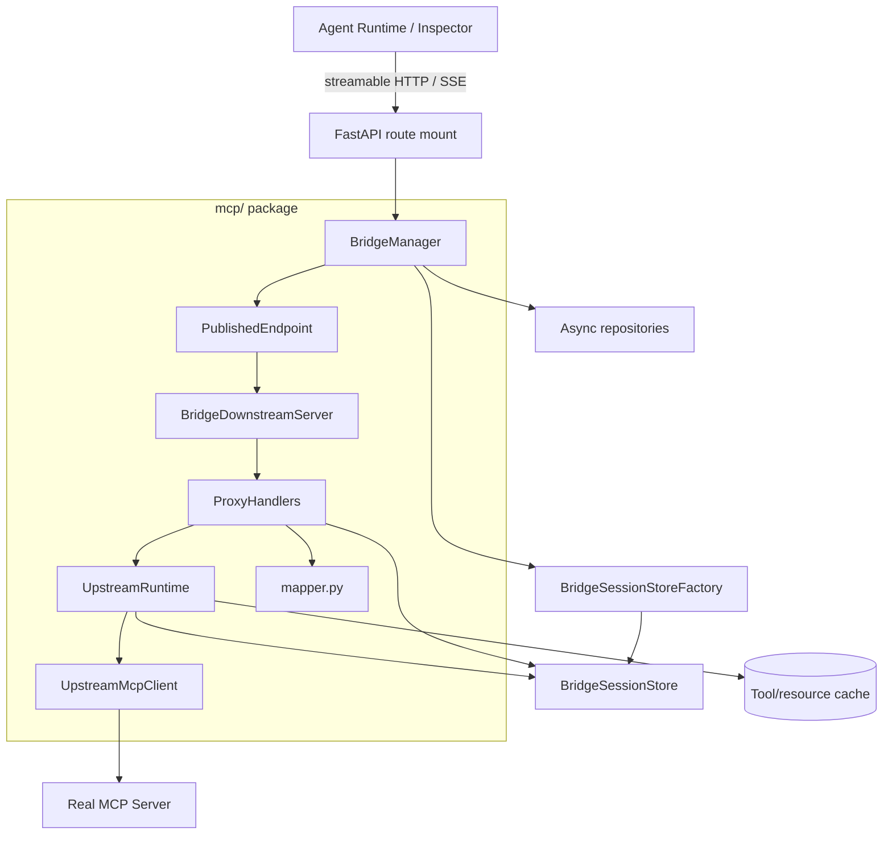
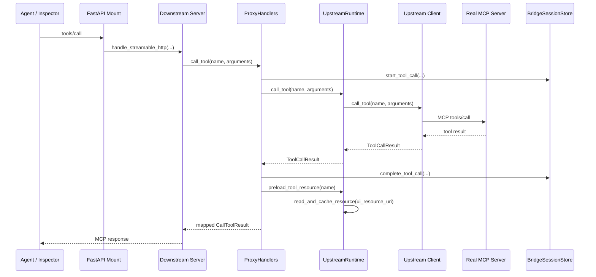
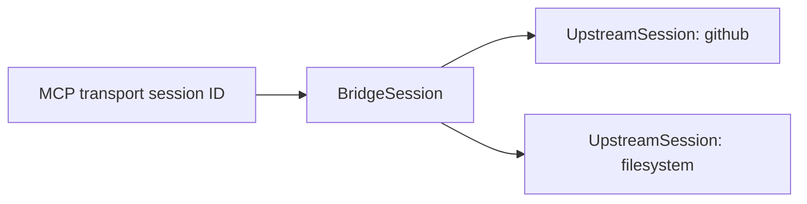

# MCP Layer Architecture

The `mcp/` package is the protocol-aware bridge boundary between downstream MCP clients and real upstream MCP servers. Downstream clients should experience the selected upstream as a normal MCP server: tools, resources, initialization metadata, and MCP Apps annotations are proxied without exposing bridge management concepts to the model.

> **Transition note:** `BridgeManager` now creates all bridge session records and stores through async repository and factory ports. Each currently published endpoint still uses one manager-created bootstrap session. The next transport-dispatch phase will replace that bootstrap runtime with one bridge session per downstream `mcp-session-id`, as defined by [ADR 0001](decisions/0001-managed-endpoints-and-session-ownership.md).

## Responsibility Model



The important ownership rule is that lifecycle flows from the host into `BridgeManager`, then into published endpoints, bridge sessions, and upstream runtimes. The CLI and FastAPI application never construct session stores. The downstream server hosts MCP transports, but it does not own upstream lifecycle or session state.

## Modules

### `manager.py` - Endpoint, Session, and Lifecycle Ownership

`BridgeManager` is the system-level MCP owner for the backend process. It registers upstream definitions, publishes endpoints, creates session records and stores, tracks transport-session bindings, and provides the lifecycle context used by FastAPI.

`PublishedEndpoint` currently binds:

- `definition`: the persistent endpoint domain definition.
- `path`: the derived downstream path `/mcp/{slug}`.
- `session_id`: the manager-created bootstrap session used during this transition.
- `runtime`: the bootstrap upstream runtime.
- `downstream`: the downstream MCP server and transport host.

Session creation is repository-backed and atomic with session-store creation. The manager exposes lookup, list, touch, close, transport binding, and reverse transport resolution operations. FastAPI accesses session snapshots and events only through these manager operations.

### `upstream.py` - Upstream MCP Clients

`upstream.py` connects to real MCP servers and normalizes SDK responses into bridge models.

Key types:

| Type | Role |
| --- | --- |
| `UpstreamServerConfig` | Transport-agnostic upstream config for `stdio`, `sse`, or `streamable-http` |
| `UpstreamMcpClient` | Protocol implemented by all upstream clients |
| `StdioUpstreamMcpClient` | stdio upstream transport |
| `SseUpstreamMcpClient` | legacy SSE upstream transport |
| `StreamableHttpUpstreamMcpClient` | streamable HTTP upstream transport |
| `build_upstream_client()` | Factory for selecting the transport client |

Boundary rules:

- Does not know about FastAPI, downstream routes, or session event storage.
- Returns internal models such as `ToolDescriptor`, `ToolCallResult`, `AppResource`, and `UpstreamInitialization`.

### `runtime.py` - Single-Upstream Runtime

`UpstreamRuntime` owns one upstream MCP session. It connects to the upstream server, tracks upstream identity, refreshes tool/resource metadata, caches loaded resources, synthesizes UI resources when needed, and records state changes through `BridgeSessionStore`.

Key methods:

| Method | Role |
| --- | --- |
| `start()` / `close()` | Connect and disconnect the upstream MCP client |
| `refresh_tools()` | Pull tools from upstream, update cache, register tools in the session store |
| `refresh_resources()` | Pull resources, or synthesize UI resources from tool metadata when upstream listing is unavailable |
| `call_tool()` | Forward `tools/call` to the upstream client |
| `preload_tool_resource()` | Load a tool's MCP App UI resource after a tool call when metadata provides one |
| `read_and_cache_resource()` | Read and cache upstream resources, then record loaded resources in the session store |
| `identity` | Exposes upstream `serverInfo` for downstream initialization responses |

Boundary rules:

- Knows about upstream clients, bridge session storage, and bridge-side caches.
- Does not know about the MCP SDK `Server`, Starlette scopes, FastAPI, or HTTP routing.

### `downstream.py` - Downstream MCP Transport Host

`BridgeDownstreamServer` owns the MCP SDK `Server` and downstream transports: streamable HTTP, SSE fallback, and stdio serving when needed.

Key methods:

| Method | Role |
| --- | --- |
| `handle_streamable_http(scope, receive, send)` | Streamable HTTP request dispatch |
| `handle_sse(scope, receive, send)` | Legacy SSE connection flow |
| `handle_sse_post(scope, receive, send)` | Legacy SSE message posting |
| `run_http_transports()` | Async context for the streamable HTTP session manager |
| `serve_stdio()` | stdio transport loop |

Identity presentation uses a runtime-provided identity callback, so downstream initialization can reflect the real upstream server rather than a bridge-internal name.

Boundary rules:

- Knows about MCP SDK transport primitives and `ProxyHandlers`.
- Does not start, close, or otherwise own the upstream runtime.
- Does not access caches or session state directly.

### `handlers.py` - MCP Method Handlers

`ProxyHandlers` registers and implements the MCP methods exposed by one downstream server:

- `tools/list`
- `tools/call`
- `resources/list`
- `resources/read`

It records tool call events in the bridge session store, delegates protocol work to `UpstreamRuntime`, and uses `mapper.py` for SDK type conversion.

Boundary rules:

- Owns MCP method behavior, not transport setup.
- May call `UpstreamRuntime` and `BridgeSessionStore`.
- Should remain a class so debugging and future handler-level dependencies stay explicit.

### `mapper.py` - Pure Protocol Mapping

`mapper.py` is stateless conversion code between internal bridge models and MCP SDK types.

Key functions:

| Function | Converts |
| --- | --- |
| `to_mcp_tool(tool)` | `ToolDescriptor` to `mcp.types.Tool` |
| `to_mcp_call_tool_result(result)` | `ToolCallResult` to `mcp.types.CallToolResult` |
| `to_mcp_resource(resource)` | `ResourceDescriptor` to `mcp.types.Resource` |
| `to_read_resource_contents(resource)` | `AppResource` to `ReadResourceContents` |
| `to_content_block(item)` | bridge content dictionaries to MCP content blocks |

Boundary rules:

- Pure functions only.
- No async, no I/O, no session state, no transport objects.

### `builder.py` - Application Assembly

`builder.py` converts the selected YAML upstream into seed domain definitions and wires in-memory repository and session-store adapters. It then asks `BridgeManager` to register the upstream and publish the passthrough endpoint. It never constructs session state directly.

Boundary rules:

- Assembly is allowed to import multiple MCP submodules because it wires ownership boundaries together.
- Runtime behavior should live in the owning modules, not in the factory.

## Request Lifecycle: `tools/call`



## Accepted Managed-Host Topology

Multiple MCP endpoints share one listener and are distinguished by path:

```text
/mcp/github       -> passthrough endpoint -> GitHub upstream
/mcp/filesystem   -> passthrough endpoint -> Filesystem upstream
/mcp/all          -> aggregate endpoint   -> GitHub + Filesystem
```

Each endpoint owns an independent MCP SDK `Server` and downstream transport session manager, but endpoints do not require separate TCP ports. A stable `/mcp/{endpoint_slug}` dispatcher will resolve the endpoint at request time so the administrative control plane can publish topology changes without rebuilding FastAPI routes.

Passthrough endpoints remain transparent and bind one upstream. Aggregate endpoints are explicit and use binding namespaces to route tool names and resource URIs without collisions.

`BridgeManager` owns the domain side of the following session relationship:



Upstream sessions are isolated per bridge session and opened lazily by default. Shared upstream sessions are an explicit policy, never a transport-derived assumption. Streamable HTTP remains the strategic transport; stdio follows the same lifecycle contracts and does not introduce a separate process-pooling architecture.

The manager already provides transport-session binding and reverse lookup. The current static endpoint mount does not yet call those operations, so all downstream requests to one published endpoint still reach its bootstrap runtime. The next implementation phase replaces static mounts with a stable dispatcher that captures the SDK response `mcp-session-id`, creates the corresponding bridge session, and resolves the correct per-session runtime on later requests.
