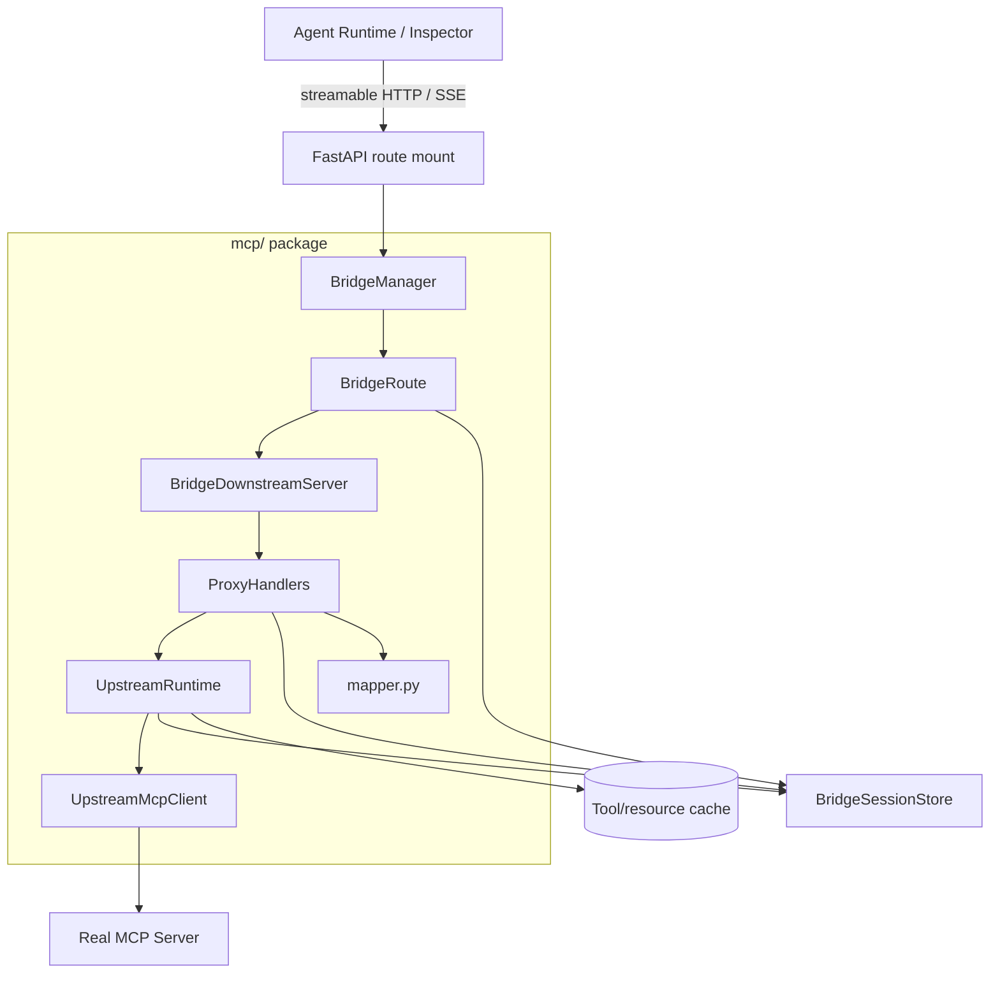
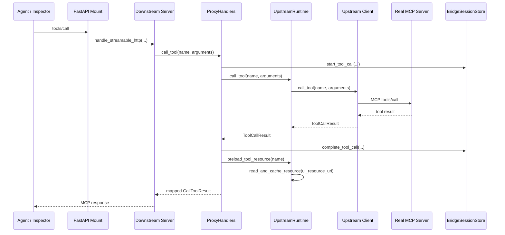

# MCP Layer Architecture

The `mcp/` package is the protocol-aware bridge boundary between downstream MCP clients and real upstream MCP servers. Downstream clients should experience the selected upstream as a normal MCP server: tools, resources, initialization metadata, and MCP Apps annotations are proxied without exposing bridge management concepts to the model.

## Responsibility Model



The important ownership rule is that lifecycle flows from the host into `BridgeManager`, then into routes and upstream runtimes. The downstream server hosts MCP transports, but it does not own upstream lifecycle or session state.

## Modules

### `manager.py` - Route and Lifecycle Ownership

`BridgeManager` is the system-level MCP owner for the backend process. It owns one or more `BridgeRoute` objects and provides the lifecycle context used by FastAPI.

`BridgeRoute` binds one downstream endpoint to one upstream runtime and one route-scoped session store:

- `path`: downstream MCP endpoint, currently `/mcp`.
- `runtime`: the upstream MCP session runtime.
- `downstream`: the downstream MCP server and transport host.
- `session_store`: the state/event store for this route.

Future multi-upstream support should add more routes rather than aggregating unrelated upstream servers behind one model-visible tool surface by default.

### `upstream.py` - Upstream MCP Clients

`upstream.py` connects to real MCP servers and normalizes SDK responses into bridge models.

Key types:

| Type | Role |
|------|------|
| `UpstreamServerConfig` | Transport-agnostic upstream config for `stdio`, `sse`, or `streamable-http` |
| `UpstreamMcpClient` | Protocol implemented by all upstream clients |
| `StdioUpstreamMcpClient` | stdio upstream transport |
| `SseUpstreamMcpClient` | legacy SSE upstream transport |
| `StreamableHttpUpstreamMcpClient` | streamable HTTP upstream transport |
| `build_upstream_client()` | Factory for selecting the transport client |

Boundary rules:

- Does not know about FastAPI, downstream routes, or session event storage.
- Returns internal models such as `ToolDescriptor`, `ToolCallResult`, `AppResource`, and `UpstreamInitialization`.

### `runtime.py` - Single-Upstream Runtime

`UpstreamRuntime` owns one upstream MCP session. It connects to the upstream server, tracks upstream identity, refreshes tool/resource metadata, caches loaded resources, synthesizes UI resources when needed, and records state changes through `BridgeSessionStore`.

Key methods:

| Method | Role |
|--------|------|
| `start()` / `close()` | Connect and disconnect the upstream MCP client |
| `refresh_tools()` | Pull tools from upstream, update cache, register tools in the session store |
| `refresh_resources()` | Pull resources, or synthesize UI resources from tool metadata when upstream listing is unavailable |
| `call_tool()` | Forward `tools/call` to the upstream client |
| `preload_tool_resource()` | Load a tool's MCP App UI resource after a tool call when metadata provides one |
| `read_and_cache_resource()` | Read and cache upstream resources, then record loaded resources in the session store |
| `identity` | Exposes upstream `serverInfo` for downstream initialization responses |

Boundary rules:

- Knows about upstream clients, route session storage, and bridge-side caches.
- Does not know about the MCP SDK `Server`, Starlette scopes, FastAPI, or HTTP routing.

### `downstream.py` - Downstream MCP Transport Host

`BridgeDownstreamServer` owns the MCP SDK `Server` and downstream transports: streamable HTTP, SSE fallback, and stdio serving when needed.

Key methods:

| Method | Role |
|--------|------|
| `handle_streamable_http(scope, receive, send)` | Streamable HTTP request dispatch |
| `handle_sse(scope, receive, send)` | Legacy SSE connection flow |
| `handle_sse_post(scope, receive, send)` | Legacy SSE message posting |
| `run_http_transports()` | Async context for the streamable HTTP session manager |
| `serve_stdio()` | stdio transport loop |

Identity presentation uses a runtime-provided identity callback, so downstream initialization can reflect the real upstream server rather than a bridge-internal name.

Boundary rules:

- Knows about MCP SDK transport primitives and `ProxyHandlers`.
- Does not start, close, or otherwise own the upstream runtime.
- Does not access caches or session state directly.

### `handlers.py` - MCP Method Handlers

`ProxyHandlers` registers and implements the MCP methods exposed by one downstream server:

- `tools/list`
- `tools/call`
- `resources/list`
- `resources/read`

It records tool call events in the route session store, delegates protocol work to `UpstreamRuntime`, and uses `mapper.py` for SDK type conversion.

Boundary rules:

- Owns MCP method behavior, not transport setup.
- May call `UpstreamRuntime` and `BridgeSessionStore`.
- Should remain a class so debugging and future handler-level dependencies stay explicit.

### `mapper.py` - Pure Protocol Mapping

`mapper.py` is stateless conversion code between internal bridge models and MCP SDK types.

Key functions:

| Function | Converts |
|----------|----------|
| `to_mcp_tool(tool)` | `ToolDescriptor` to `mcp.types.Tool` |
| `to_mcp_call_tool_result(result)` | `ToolCallResult` to `mcp.types.CallToolResult` |
| `to_mcp_resource(resource)` | `ResourceDescriptor` to `mcp.types.Resource` |
| `to_read_resource_contents(resource)` | `AppResource` to `ReadResourceContents` |
| `to_content_block(item)` | bridge content dictionaries to MCP content blocks |

Boundary rules:

- Pure functions only.
- No async, no I/O, no session state, no transport objects.

### `proxy.py` - Assembly Factory

`proxy.py` is the construction layer for the current single-route runtime. `build_bridge_manager()` creates the session-bound `UpstreamRuntime`, `ProxyHandlers`, `BridgeDownstreamServer`, `BridgeRoute`, and `BridgeManager`.

Boundary rules:

- Assembly is allowed to import multiple MCP submodules because it wires ownership boundaries together.
- Runtime behavior should live in the owning modules, not in the factory.

## Request Lifecycle: `tools/call`



## Future Expansion

For multi-upstream support, prefer one route per upstream:

```text
/mcp/github       -> BridgeRoute(github runtime, github session store)
/mcp/filesystem   -> BridgeRoute(filesystem runtime, filesystem session store)
/mcp/mock-http    -> BridgeRoute(mock-http runtime, mock-http session store)
```

Aggregation can be added later if a product need proves it, but it should be a deliberate layer above route ownership. The default bridge behavior should remain transparent: from the model's perspective, it is interacting with the intended MCP server and tools, not with bridge administration APIs.