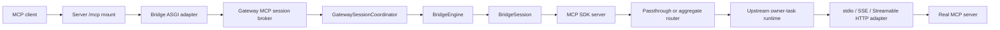

# MCP Layer Architecture

`mabrid.bridge` is the protocol-aware boundary between downstream MCP clients and real upstream
MCP servers. It preserves supported MCP and MCP Apps values while keeping topology, persistence,
and product management concepts out of the model-visible protocol surface.

## Dependency And Request Flow

```mermaid
flowchart LR
    Client["MCP client"] --> Mount["Server /mcp mount"]
    Mount --> ASGI["Bridge ASGI adapter"]
    ASGI --> Broker["Gateway MCP session broker"]
    Broker --> Coordinator["GatewaySessionCoordinator"]
    Coordinator --> Engine["BridgeEngine"]
    Engine --> Session["BridgeSession"]
    Session --> Downstream["MCP SDK server"]
    Downstream --> Router["Passthrough or aggregate router"]
    Router --> Runtime["Upstream owner-task runtime"]
    Runtime --> Adapter["stdio / SSE / Streamable HTTP adapter"]
    Adapter --> Upstream["Real MCP server"]
```

The server only mounts `create_mcp_asgi_app(GatewayMcpSessionBroker(gateway))`. It does not parse
MCP paths, methods, headers, session IDs, or SSE messages.

## Downstream Transport

`mabrid.bridge.downstream` owns:

- endpoint-key extraction below the `/mcp` mount;
- Streamable HTTP method and `mcp-session-id` handling;
- response-header capture and transport-session binding;
- legacy `/sse` and `/messages` query normalization;
- MCP SDK v1 server registration and response mapping; and
- the future boundary for stateful, stateless, or newer protocol profiles.

The ASGI adapter depends on `McpSessionBroker`, which opens, resolves, binds, and closes opaque
sessions. The Gateway implementation owns application records and live lifecycle. Transport
correlation uses process-local indexes because an SDK transport session cannot be recovered after
process restart; it is deliberately absent from the application record and SQLite schema.

## Session Lifecycle

`PublishedTopology` loads complete immutable endpoint revisions from `TopologyReader` and
materializes one `EndpointPlan` for each process-lifetime publication. `GatewaySessionCoordinator`
then owns only live session behavior:

1. Create the application session record and inspection store.
2. Construct a `SessionInspectionProjector` for core observations.
3. Ask `BridgeEngine` to open a hosted `BridgeSession` from the captured plan.
4. Run its downstream transport lifecycle in the coordinator task group.
5. Maintain live transport-ID correlation in memory.
6. Close the core session and persist the terminal application status.

An active session never observes a later topology revision.

## Bridge Engine

`BridgeEngine` owns the structured task group for all upstream owner tasks. `BridgeSession` owns:

- one immutable endpoint plan;
- one passthrough or aggregate router;
- one upstream runtime per enabled binding;
- one downstream MCP SDK server and transport host; and
- idempotent reverse-order cleanup.

Application code does not construct `ProxyHandlers`, routers, or SDK servers directly.

## Upstream Runtime And Adapters

Each binding has one persistent `UpstreamRuntime` owner task. All operations on its stateful SDK
session execute through a typed command channel in that task, including connect, discovery, calls,
reads, reconnect, and shutdown. This preserves AnyIO cancel-scope ownership.

Transport implementations are isolated under `mabrid.bridge.upstream`:

- `stdio.py` owns subprocess stdio connection setup;
- `sse.py` owns legacy upstream SSE compatibility;
- `streamable_http.py` owns primary HTTP connection setup and initialization timeout;
- `base.py` maps initialized SDK session values to core protocol contracts; and
- `factory.py` selects a fresh adapter for one binding.

Streamable HTTP uses exactly the configured URL. It does not probe with `OPTIONS`, inspect WSL,
or substitute hostnames.

## Routing

Passthrough preserves upstream names and resource URIs. Aggregate routing applies deterministic,
stable names and exact route registration:

- tools: `{namespace}__{upstream_tool_name}`;
- ordinary resources: `{namespace}+{original_uri}`; and
- MCP Apps resources: `ui://{namespace}/{opaque_token}`.

Only registered public resource URIs are routing authority. Aggregate discovery returns healthy
bindings in deterministic order during partial failures and emits binding availability
observations.

Resource discovery fallback is conservative. UI resources may be synthesized from tool metadata
only when the upstream did not advertise the resources capability. If an upstream advertises the
capability and `resources/list` fails, the error is propagated.

## Protocol Values

Core-owned models preserve the supported MCP values needed for routing and transparent forwarding.
`ReadResourceResult` contains every `ResourceContent`, including each URI, text/blob value, MIME
type, item metadata, and result metadata. Inspection timestamps are not part of these protocol
values.

SDK-specific conversion lives only in `mabrid.bridge.downstream.sdk_v1` and the initialized
upstream client mapper. The lower-level SDK resource handler is used where convenience decorators
would discard result metadata or replace content URIs.

## Inspection Boundary

Routers and handlers emit immutable `BridgeObservation` values. The application
`SessionInspectionProjector` validates the session key and explicitly maps each observation into
the `BridgeSessionStore` port. It updates durable events and snapshots without an intermediate
journal DTO vocabulary or implicit `model_dump()`/`model_validate()` copying.

The SQLite adapter serializes application-owned event and snapshot contracts. Core never imports
those models or knows whether inspection is persisted.

## Supported Profile

The v0.1 bridge profile currently covers:

- `initialize`;
- `tools/list` and `tools/call`;
- `resources/list` and complete `resources/read` results;
- supported MCP Apps metadata and resource references;
- downstream and upstream Streamable HTTP;
- stdio upstreams; and
- isolated legacy SSE compatibility.

Prompt aggregation, list-changed notifications, cross-version conversion, stateless post-2025
profiles, and MCP Python SDK v2 require separate contract work. Unsupported behavior is not
advertised or represented by dormant configuration fields.
